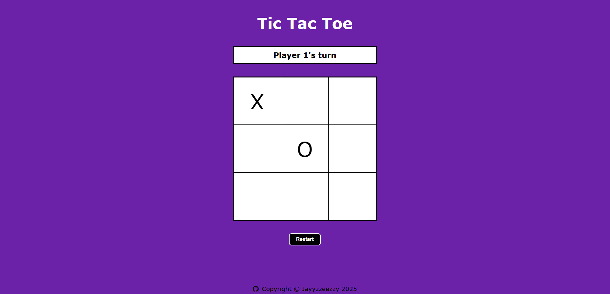
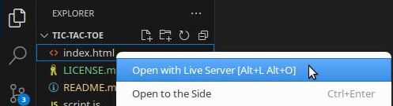

# Tic Tac Toe

## Description

The purpose of this web app is to implement alternative ways to organize code in JavaScript.

In this app, I used factory functions to generate objects. This is one of the alternative method in contrast to the class method. I practiced this organization method because it allows me to read more code written in different styles.

## Features

- Function Factories
- User events

## Installation

1. **Fork the Repository**

    - Follow the documentation on GitHub to [fork this repository](https://docs.github.com/en/pull-requests/collaborating-with-pull-requests/working-with-forks/fork-a-repo).  

    - You should also have a local clone of the forked repository after following the tutorial.

2. **Move to the cloned directory**

    ``cd tic-tac-toe``

3. **Launch Preview**

    Right click on ``index.html``, then select **Open with Live Server**

    

## Contribute

- Issue Tracker: github.com/jayyzzeezzy/tic-tac-toe/issues
- Source Code: github.com/jayyzzeezzy/tic-tac-toe.git

## Support

Let me know if you encounter any issues.  
Email me at: <jam9es@gmail.com>

## License

The project is licensed under the [MIT license](LICENSE.md).
